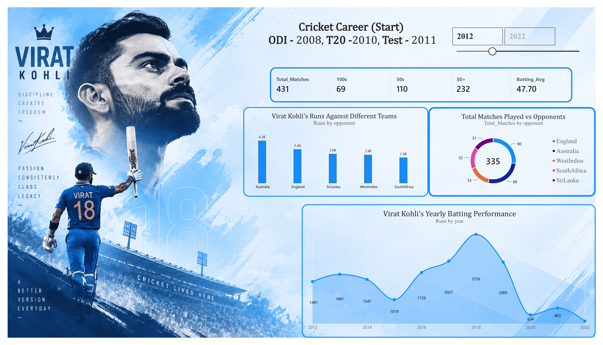

# Virat Kohli — Cricket Career Performance Dashboard 🏏

An interactive Power BI dashboard developed to analyze and visualize Virat Kohli's cricket career performance across different years, opponents, and key batting metrics.

## 📊 Dashboard Overview

The dashboard transforms match-by-match cricket performance data into an interactive visual report, providing a concise overview of Kohli's batting performance and allowing users to explore trends across his career.

### Key Performance Metrics

| Metric | Value |
|---|---:|
| Total Matches | 431 |
| 100s | 69 |
| 50s | 110 |
| 30+ Scores | 232 |
| Batting Average | 47.70 |

## 📈 Analysis & Visualizations

The dashboard includes the following analyses:

- **Opponent-wise Runs** — Total runs scored against different teams.
- **Opponent-wise Matches** — Number of matches played against each opponent.
- **Year-wise Runs Trend** — Analysis of yearly batting performance and changes in run-scoring over time.
- **KPI Cards** — Displays important career metrics such as total runs, centuries, highest score, and matches played.
- **Interactive Filters & Drill-Downs** — Enables exploration by year, opponent, and format.

### Opponents Analyzed

- Australia
- England
- Sri Lanka
- West Indies
- South Africa

## 🛠️ Data Preparation & Development

### Step 1 — Data Import & Transformation

Match-by-match performance data was imported from **ESPN Cricinfo** into Power BI.

The dataset was cleaned and transformed using **Power Query** to prepare it for analysis and visualization.

### Step 2 — Calendar Table

A dedicated calendar table was created using DAX to support time-based analysis.

```DAX
Calender = CALENDAR(
    DATE(YEAR(MIN(Virat_Kohli[date])), 1, 1),
    DATE(YEAR(MAX(Virat_Kohli[date])), 12, 31)
)
```

### Step 3 — Date Dimension

Additional date attributes were created to enable chronological analysis and time-based filtering.

```DAX
day = FORMAT(Calender[Date], "ddd")
day_no = DAY(Calender[Date])
month = FORMAT(Calender[Date], "mmm")
month_no = MONTH(Calender[Date])
```

These columns provide day names, day numbers, month names, and month numbers for the calendar dimension.

### Step 4 — Key DAX Measures

Several DAX measures were created to calculate the primary performance indicators used throughout the dashboard.

```DAX
100s = SUM(Virat_Kohli[100s])

30+ = SUM(Virat_Kohli[30+])

50s = SUM(Virat_Kohli[50s])

HighestScore = MAX(Virat_Kohli[runs])

Runs = SUM(Virat_Kohli[runs])

Total_Matches = COUNT(Virat_Kohli[opponent])
```

These measures form the foundation of the dashboard's KPI cards and performance visualizations.

## 🧩 Power BI Features Used

- **Power Query** for data cleaning and transformation
- **DAX** for calculated measures and time-based analysis
- **Calendar Table** for date analysis
- **KPI Cards** for performance summaries
- **Bar Charts** for opponent-wise comparisons
- **Donut Chart** for match distribution by opponent
- **Line/Area Chart** for yearly performance trends
- **Slicers & Filters** for interactive exploration
- **Drill-Downs** for deeper analysis

## 🎯 Project Objective

The objective of this project is to convert raw cricket performance data into an interactive business-intelligence style dashboard.

The analysis focuses on identifying performance patterns across different opponents and years while presenting key statistics in a clear and visually accessible format.

## 🖼️ Dashboard Preview



## 📁 Repository Structure

```text
virat-kohli-powerbi-dashboard/
│
├── Screenshots/
│   └── dashboard.png
│
├── Report/
│   └── Virat_Kohli_Career.pdf
│
└── README.md
```

## 📄 Report

A PDF export of the completed dashboard is available in the `Report` folder.

The PDF provides a static view of the final dashboard without requiring Power BI.

## 🔒 Project File

The original Power BI `.pbix` file is not included in this repository.

The repository instead provides the final dashboard output, documentation, and the DAX calculations used to build the analysis.

## 🛠️ Tools & Technologies

- Microsoft Power BI
- Power Query
- DAX
- Data Cleaning
- Data Visualization
- Data Analysis

## 📚 Data Source

**ESPN Cricinfo**

The project uses match-by-match cricket performance data sourced from ESPN Cricinfo.

## 👤 Author

**Saanvi Grover**
